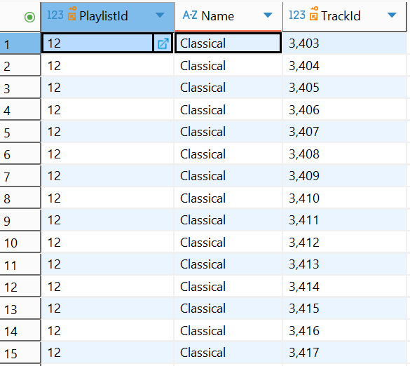

## SQL-Guidebook
Practicing Basic to Advanced SQL queries

This assingment is for practicing SQL queries and to use it as a guidebook for interview preparation.

## Loading a Database and Creating tables within it.

I used a dataset about music from Kaggle to work on this assignment.

## Loading the dataset

I used Dbeaver to easily connect with the database to run queries.

# Loading the Dataset

Installed Dbeaver and clicked on an icon which connects to the database after specifying the filepath. You can download it from this website https://dbeaver.io/ and follow the instructions to set it up. 

anything that starts with a '--' means I am commenting what the code does.

The below queries are posted to show how the tables are created and how some are connected to show the Data Setup.

```sql
CREATE TABLE [Album]  --creates a table called 'Album'
(
    [AlbumId] INTEGER  NOT NULL, --creates a column neamed 'AlbumId' which does not have any null values and consists of integers.
    [Title] NVARCHAR(160)  NOT NULL, --creates a column called 'Title' which does not have any null values and maximum number of characters of each of the values of the columns being 160.
    [ArtistId] INTEGER  NOT NULL, --creates a column called 'ArtisiId' which does not have any null values and consists of integers.
    CONSTRAINT [PK_Album] PRIMARY KEY ([AlbumId]), --'CONSTRAINT' assigns what is to be done. '[PK_Album]' means Primary Key of the Artist table and specifies the column 'AlbumId' is the primary key of the table. A primary key uniquely identifies each record in a table and must be unique and not NULL. In other words, 'CONSTRIANT' says make ArtistID the primary key of this table. 
    FOREIGN KEY ([ArtistId]) REFERENCES [Artist] ([ArtistId])  --Creates a relationship between the Album table and the Artist table. It says that the values in ArtistId column of Album table must match an existing ArtistId values in the Artist table.
        ON DELETE NO ACTION ON UPDATE NO ACTION  --Prevents deletion or updating of the referenced ArtistId if it's used in any album. Ensures referential integrity (i.e., albums can't reference non-existent artists).
);

CREATE INDEX [IFK_AlbumArtistId] ON [Album] ([ArtistId]); --Creates an index on the ArtistId column in the Album table. This improves the performance of queries that filter or join using ArtistId, especially when retrieving albums by artist.

This is a way to create a table.

More tables of the database:

CREATE TABLE [Artist] --this table has names of the artists
(
    [ArtistId] INTEGER  NOT NULL,
    [Name] NVARCHAR(120),
    CONSTRAINT [PK_Artist] PRIMARY KEY  ([ArtistId])  --'[PK_Artist]' means Primary Key of the Artist table and specifies that column ArtistId is the primary key of the table. A primary key uniquely identifies each record in a table and must be unique and not NULL.
);

CREATE TABLE [Customer]  --this is the table of customers who bought albums and it contains their contact info, their names, where thet live, and how much they paid 
(
    [CustomerId] INTEGER  NOT NULL,
    [FirstName] NVARCHAR(40)  NOT NULL,
    [LastName] NVARCHAR(20)  NOT NULL,
    [Company] NVARCHAR(80), --if 'NOT NULL' is not mentioned, then the column can have NULL values.
    [Address] NVARCHAR(70),
    [City] NVARCHAR(40),
    [State] NVARCHAR(40),
    [Country] NVARCHAR(40),
    [PostalCode] NVARCHAR(10),
    [Phone] NVARCHAR(24),
    [Fax] NVARCHAR(24),
    [Email] NVARCHAR(60)  NOT NULL,
    [SupportRepId] INTEGER,
    CONSTRAINT [PK_Customer] PRIMARY KEY  ([CustomerId]),
    FOREIGN KEY ([SupportRepId]) REFERENCES [Employee] ([EmployeeId]) 
		ON DELETE NO ACTION ON UPDATE NO ACTION
);

CREATE INDEX [IFK_CustomerSupportRepId] ON [Customer] ([SupportRepId]); --creates an index named  [IFK_CustomerSupportRepId] on the [SupportRepId] column in the Customer table, the purpose is to improve the performance of queries that filter or join using SupportRepId.

CREATE TABLE [Employee]  --this table is the employee table which has their names, who they report to, wheer they live, and their contact info.
(
    [EmployeeId] INTEGER  NOT NULL,
    [LastName] NVARCHAR(20)  NOT NULL,
    [FirstName] NVARCHAR(20)  NOT NULL,
    [Title] NVARCHAR(30),
    [ReportsTo] INTEGER,
    [BirthDate] DATETIME,
    [HireDate] DATETIME,
    [Address] NVARCHAR(70),
    [City] NVARCHAR(40),
    [State] NVARCHAR(40),
    [Country] NVARCHAR(40),
    [PostalCode] NVARCHAR(10),
    [Phone] NVARCHAR(24),
    [Fax] NVARCHAR(24),
    [Email] NVARCHAR(60),
    CONSTRAINT [PK_Employee] PRIMARY KEY  ([EmployeeId]),
    FOREIGN KEY ([ReportsTo]) REFERENCES [Employee] ([EmployeeId]) --The 'ReportsTo' column must contain values that exist in the EmployeeId column of the Employee table.
		ON DELETE NO ACTION ON UPDATE NO ACTION
);

CREATE INDEX [IFK_EmployeeReportsTo] ON [Employee] ([ReportsTo]);

CREATE TABLE [Genre]  --this table has info on different genres like Rock, Metal, R&B, HipHop and so on.
(
    [GenreId] INTEGER  NOT NULL,
    [Name] NVARCHAR(120),
    CONSTRAINT [PK_Genre] PRIMARY KEY  ([GenreId])
);

CREATE TABLE [Invoice] -- this is the invoive table of customers who bought purchased items including when and at what time they bought, where they live and how much the customers paid.
(
    [InvoiceId] INTEGER  NOT NULL,
    [CustomerId] INTEGER  NOT NULL,
    [InvoiceDate] DATETIME  NOT NULL,
    [BillingAddress] NVARCHAR(70),
    [BillingCity] NVARCHAR(40),
    [BillingState] NVARCHAR(40),
    [BillingCountry] NVARCHAR(40),
    [BillingPostalCode] NVARCHAR(10),
    [Total] NUMERIC(10,2)  NOT NULL,
    CONSTRAINT [PK_Invoice] PRIMARY KEY  ([InvoiceId]),
    FOREIGN KEY ([CustomerId]) REFERENCES [Customer] ([CustomerId]) 
		ON DELETE NO ACTION ON UPDATE NO ACTION
);

CREATE INDEX [IFK_InvoiceCustomerId] ON [Invoice] ([CustomerId]);

CREATE TABLE [Playlist]  --table contains info on playlists
(
    [PlaylistId] INTEGER  NOT NULL,
    [Name] NVARCHAR(120),
    CONSTRAINT [PK_Playlist] PRIMARY KEY  ([PlaylistId])
);

CREATE TABLE [PlaylistTrack]  --table contains info on playlist tracks (trackIds)
(
    [PlaylistId] INTEGER  NOT NULL,
    [TrackId] INTEGER  NOT NULL,
    CONSTRAINT [PK_PlaylistTrack] PRIMARY KEY  ([PlaylistId], [TrackId]),
    FOREIGN KEY ([PlaylistId]) REFERENCES [Playlist] ([PlaylistId]) 
		ON DELETE NO ACTION ON UPDATE NO ACTION,
    FOREIGN KEY ([TrackId]) REFERENCES [Track] ([TrackId]) 
		ON DELETE NO ACTION ON UPDATE NO ACTION
);

CREATE INDEX [IFK_PlaylistTrackPlaylistId] ON [PlaylistTrack] ([PlaylistId]);
CREATE INDEX [IFK_PlaylistTrackTrackId] ON [PlaylistTrack] ([TrackId]);

CREATE TABLE [Track]   --info on composers, their albums, length of tracks in milliseconds and bytes, their unit prices, and genres(just genreID not their names)
(
    [TrackId] INTEGER  NOT NULL,
    [Name] NVARCHAR(200)  NOT NULL,
    [AlbumId] INTEGER,
    [MediaTypeId] INTEGER  NOT NULL,
    [GenreId] INTEGER,
    [Composer] NVARCHAR(220),
    [Milliseconds] INTEGER  NOT NULL,
    [Bytes] INTEGER,
    [UnitPrice] NUMERIC(10,2)  NOT NULL,
    CONSTRAINT [PK_Track] PRIMARY KEY  ([TrackId]),
    FOREIGN KEY ([AlbumId]) REFERENCES [Album] ([AlbumId]) 
		ON DELETE NO ACTION ON UPDATE NO ACTION,
    FOREIGN KEY ([GenreId]) REFERENCES [Genre] ([GenreId]) 
		ON DELETE NO ACTION ON UPDATE NO ACTION,
    FOREIGN KEY ([MediaTypeId]) REFERENCES [MediaType] ([MediaTypeId]) 
		ON DELETE NO ACTION ON UPDATE NO ACTION
);

CREATE INDEX [IFK_TrackAlbumId] ON [Track] ([AlbumId]);
CREATE INDEX [IFK_TrackGenreId] ON [Track] ([GenreId]);
CREATE INDEX [IFK_TrackMediaTypeId] ON [Track] ([MediaTypeId]);

CREATE TABLE [MediaType]  --table of different mediatype info like MPEG, ACC and so on.
(
    [MediaTypeId] INTEGER  NOT NULL,
    [Name] NVARCHAR(120),
    CONSTRAINT [PK_MediaType] PRIMARY KEY  ([MediaTypeId])
);

Question 1: List the names of rock songs 'Alanis Morissette & Glenn Ballard' have made.
SELECT              
	g.Name, 
	t.Composer,
	t.Name
FROM
	Track as t
RIGHT JOIN Genre as g
	ON
	g.GenreID = t.GenreID
WHERE
	(g.Name = 'Rock'
		AND t.composer = 'Alanis Morissette & Glenn Ballard')
LIMIT 15;
```
Explanation: This query selects Name columns from both the track and Genre tables and Composer column from the Track table and does a right join where all the rows of the table on the right (Genre) matches with the rows in the left table (Track) by a many-to-one relationship using the GenreID column of both the tables and returns the list of rock songs Alanis Morissette & Glenn Ballard have made. The acronyms g and t are the aliases of the tables Genre and Track respectively and aliases are creating using the 'as' keyword. It is created for better readibility and convienience. The 'WHERE' clause filters rows which meets a certain criteria, and here it is to locate 'Rock' songs made by the composer 'Alanis Morissette & Glenn Ballard'. 
Output: 

```sql
Question 2: Give me a report of customers from Argentina to see the proportion of customers who sepnt less than, equal to and greater than $10.
SELECT
	BillingCountry,
	Total,
	CASE
		WHEN Total < 10 THEN 'Too Low'
		WHEN Total = 10 THEN 'At 10'
		WHEN Total > 10 THEN 'Too High'
	END AS total_category
FROM
	Invoice
WHERE
	BillingCountry = 'Argentina';
```
Explanation: This query returns an output of customers from 'Argentina' who paid less than $10('Too Low'), equal to $10('At 10'), and greater than $10('Too High') from the Invoice table. Logical statements in SQL are done using CASE WHEN statements. Case acts like 'if' and 'elseif' and then would assign the names to the respective criteria. You should end the case statements with the keyword 'END'. 'AS' aliases the name of the column which shows the results of the CASE WHEN statements for each of the rows. 
Output: 

```sql
Question 3: Give me a sample of invoice rankings for Argentina using multiple ranking.
SELECT
	BillingCountry,
	Total,
	RANK() OVER (PARTITION BY BillingCountry
ORDER BY
	Total DESC) AS rank_within_country,
	DENSE_RANK() OVER (PARTITION BY BillingCountry
ORDER BY
	Total DESC) AS cumulative_rank_within_country,
	ROW_NUMBER() OVER (PARTITION BY BillingCountry
ORDER BY
	Total DESC) AS rownumber_country
FROM
	Invoice
WHERE
	BillingCountry = 'Argentina';
```
Explanantion: This query returns multiple ranks of purchases for customer from 'Argentina'. Rank() ranks the rows based on the values in the Total column in descending order within each country in the 'BillingCountry' column so does the DENSE_RANK() and ROW_NUMBER() commands, but they do it in different ways. If you look at 'rank_within_country' column, you would see that 5 appears twice (due to the tie) and right after that you see 7, this is because the RANK() ranks numbers based on which row number they are in. If you look closely, you will see that the second number 5 is in row number 6 (just a side note). Whereas for DENSE_RANK() it ranks numbers numerically (look at the 'cumulative_rank_within_country' column). If you look at the 'rownumber_country' column, you will see that it ranks everything numerically in descending order, but doesn't care about the tied values. The WHERE clause filters the rows where the 'BillingCountry' is 'Argentina'. The table used here is the Invoice table. 
Output: 

```sql
Question 4: What are the average, minimum and maximum costs of the customers? Also return the number of purchases made by each of them. Return an output of 15 rows.

WITH mini_table AS (
SELECT
	C.FirstName,  
	C.LastName,
	CONCAT(C.FirstName, ' ', C.LastName) AS FullName,
	AVG(I.Total) AS avg_purchase_per_customer,
	MIN(I.Total) AS min_total,
	MAX(I.Total) AS max_total,
	COUNT(I.Total) AS count_total
FROM
	Customer AS C
LEFT JOIN Invoice AS I
        ON
	C.CustomerId = I.CustomerId
GROUP BY
	C.FirstName,
	C.LastName
)

SELECT
	AVG(avg_purchase_per_customer),
	MIN(min_total),
	MAX(max_total),
	COUNT(count_total)
FROM
	mini_table
ORDER BY
	FullName;
```
Explanation: This query uses a temporary table named 'mini_table' to create a table using a left join with two existing tables Customer (as the left table) and Invoice (as the right table) by one-to-many relationship (where the rows on the customer table would match with the rows on the right table (Invoice)). It performs a LEFT JOIN between the Customer and Invoice tables based on the CustomerId, ensuring that all customers are included even if they have no invoices. The inner query shows the FirstName, LastName columns from the Customers table (FullName column is created by concatenating the FirstName and LastName columns from the Customers table) and the aggregate functions AVG, MIN, MAX, and COUNT used on the Total column from the Invoice table. The outer query (the query outside of the mini_table) would generate the average, minimum, and maximum values of avg_purchase_per_customer, min_total, and max_total columns of the inner query (mini_table). Basically it provides the overall average, minimum, maximum, and count of the total column of customers in this merged table. 'AS' is the keyword used for aliasing a column or a table. 'ORDER BY' clause orders by FullName in ascending order alphabetically.  
Output: 

```sql
Question 5: What is the tracks of Classical music?

SELECT
	plyt.PlaylistId,
	ply.Name,
  plyt.TrackId
FROM
	Playlist ply
INNER JOIN PlaylistTrack plyt
	ON
	ply.PlaylistId = plyt.PlaylistId
WHERE
	ply.Name = 'Classical'
LIMIT 15; 
```
Explanation: This query returns the first 15 track IDs of 'Classical' music. The WHERE clause specifies which rows to look for. Here it checks for the tracks where the name of the playlist is Classical. This query uses an inner join where only the matching rows of both the tables 'Playlist' and 'PlaylistTrack' are joined and kept. Here the tables are joined on the 'PlayistId' column of both the tables. 
Output: 

```sql
Question 6: Retreive a list of Names of Media types whose Bytes are between 8226934 AND 12675305 
SELECT
	m.Name,
	t.Bytes
FROM
	Track AS t
FULL OUTER JOIN MediaType AS m
	ON
	t.MediaTypeID = m.MediaTypeID
WHERE
	t.Bytes BETWEEN 8226934 AND 12675305
LIMIT 15;
```
Explanation:  The query returns the Names and Bytes of 15 MediaTypes which falls between 8226934 AND 12675305 bytes. Here a outer join is used that would create a many-to-many relationship between tables Track and MediaType. 
Output: 

```sql
Question 7: Which customers didn't buy anything? 
SELECT
	CustomerId
FROM
	Customer
EXCEPT 

SELECT
	CustomerId
FROM
	Invoice
  LIMIT 15;
```
Explanation: The first part of the code before 'EXCEPT' returns all the customers and the second part of the code after 'EXCEPT' returns only all invoices. The 'EXCEPT' operation looks at both the queries before and after it, and takes only those customers who don't have any invoices. In this case, there are no customers who didn't make purchases. 
Output: 

```sql
Question 8: For each customer's purchase, what were the amounts of their previous and next purchases?
SELECT
	CustomerId,
	InvoiceDate,
	Total,
	LAG(Total) OVER (PARTITION BY CustomerId
ORDER BY
	InvoiceDate) AS PrevPurchase,
	LEAD(Total) OVER (PARTITION BY CustomerId
ORDER BY
	InvoiceDate) AS NextPurchase
FROM
	Invoice
LIMIT 15;
```
Explanation: This query shows each customer's invoice along with the total of their previous and next purchases, ordered by invoice date in ascending order. LEAD() calcuates forward (forward rows of purchases) purchases within each customer and LAG() does the same but calculates previous rows of purchases within each customer. Here you would see 15 rows due to the LIMIT specified. 
Output: 

```sql
Question 9: Insert a row of data of an employee into the Employee table with the following data: Employee ID = 9, LastName = 'Joseph', FirstName = 'Priya', Title = 'Sales Manager', ReportsTo = 1, Birthdate = '1973-03-10 00:00:00', HireDate = '2004-03-10 00:00:00', Address = '1111 Andrew Drive NW', City = 'Edmonton', State= 'AB', Country = 'Canada', Email = 'priya@gmail.com'

INSERT
	INTO
	Employee (EmployeeId,
	LastName,
	FirstName,
	Title,
	ReportsTo,
	BirthDate,
	HireDate,
	Address,
	City,
	State,
	Country,
	Email)
VALUES (9,
'Joseph',
'Priya',
'Sales Manager',
1,
'1973-03-10 00:00:00',
'2004-03-10 00:00:00',
'1111 Andrew Drive NW',
'Edmonton',
'AB',
'Canada',
'priya@chinook.corp');
```

Explanation: This query inserts the mentioned information into the appropriate columns using the INSERT INTO clause into the Employee table. This adds a new row of information to the Employee Table.
Output:  


```sql
Question 10: Update the row of 'Laura Callahan' whose employee ID is 8 by changing her email address to 'laura@chinookcorp.com' from 'priya.newemail@example.com'.
UPDATE
	Employee
SET
	Email = 'laura@chinookcorp.com'
WHERE
	EmployeeId = 8;
```
Explanation: This query updates the information using the UPDATE clause which sets the information using the clause 'SET' to the Email column to the employee ID 8. 
Output: 


